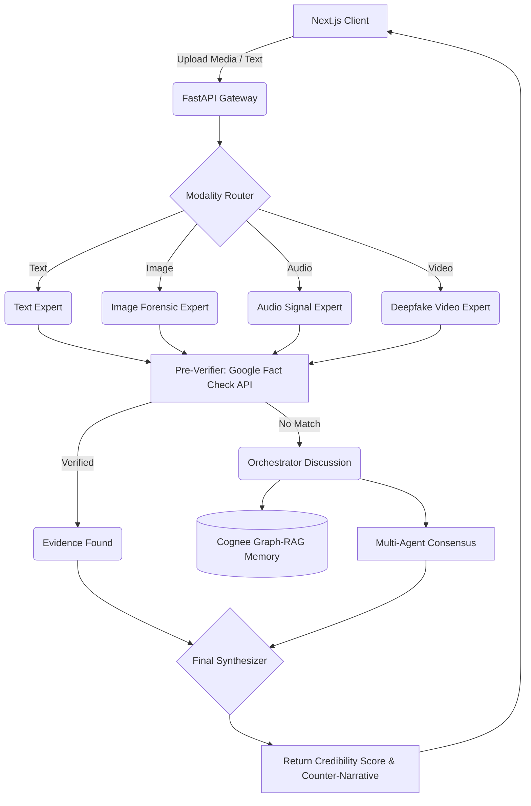

<div align="center">
  <h1>🛡️ PHEME: AI Against Misinformation</h1>
  <p><b>Real-time Multimodal Fact-Checking & Deepfake Detection Engine</b></p>
  <p>
    
    
    
    
</p>
</div>

---

## 📌 Overview

**PHEME** (SachCheck.in-CODEWIZARD2.0) is a high-fidelity, real-time misinformation detection and counter-narrative orchestration system. With the rapid propagation of AI-generated content (deepfakes, voice clones, and synthetic text), PHEME serves as an advanced defense mechanism.

It autonomously routes incoming media (Text, Images, Audio, Video) to specialized AI experts, cross-references claims against the live **Google Fact Check API** and an internal **Cognee Graph-RAG Memory**, and synthesizes verifiable, context-rich counter-narratives when fake news is detected.

---

## 📸 Screenshots
*(Add your screenshots here)*
<div align="center">
  
  <br/>
  <em>PHEME Fact-Checking Dashboard</em>
  <br/><br/>
  
  <br/>
  <em>Deepfake & Audio Forensic Analysis</em>
</div>

---

## ✨ Key Features

- **🌐 Live Fact-Checking**: Integrates directly with the Google Fact Check Explorer to ground verifications in real-world journalistic outputs.
- **🧠 Multi-Agent Orchestration**: Utilizes **LangGraph** to coordinate discussions between multiple specialized agents (System Intellect, Research Agent, Synthesizer).
- **👁️ Multimodal Forensics**:
    - **Text Analysis**: Validates claims, scores credibility, and identifies logical inconsistencies.
    - **Image & OCR Forensics**: Detects visual anomalies and AI-generation artifacts using Gemini 1.5 Flash.
    - **Audio Signal Processing**: Transcribes spoken claims and detects voice cloning signatures.
    - **Video Deepfake Detection**: Operates highly accurate temporal context scanning for manipulated media.
- **🕸️ Graph-RAG Memory**: Connects to Neo4j and Kuzu via `cognee` to build a persistent memory of prior fact-checks and relationships.
- **💻 Kinetic Frontend UI**: Provides a sleek, glass-morphic interface built on Next.js 15, Tailwind, and Framer Motion.

---

## 🛠️ Tech Stack

### Frontend Architecture
* **Framework**: Next.js (App Router, Turbopack)
* **Styling**: Tailwind CSS + Framer Motion (Kinetic UI)
* **Components**: Lucide React Icons

### Backend Orchestration
* **API Engine**: FastAPI (Asynchronous Python backend)
* **Agentic Framework**: LangGraph + LangChain
* **LLM Engine**: Gemini 1.5 Flash / Pro via `instructor` and Google GenAI
* **Graph-RAG**: Cognee (Neo4j / Kuzu Graph DB integration)
* **Vector Store**: Qdrant (via FastEmbed)

---

## ⚙️ Installation & Setup

### Prerequisites
- Node.js (v18+)
- Python (v3.11 / v3.12)
- API Keys: `GEMINI_API_KEY` (Store in `core/google_creds.json` or `.env`)

### 1. Backend Setup (FastAPI + LangGraph)
Open a terminal and set up the Python backend environment.

```bash
# Clone the repository
git clone https://github.com/nishant-awasthi026/SachCheck.in-CODEWIZARD2.0.git
cd SachCheck.in-CODEWIZARD2.0

# Install dependencies
pip install -r requirements.txt

# Start the Python FastAPI backend (Port 8000)
python main.py
```
*The backend will boot up, initialize the Cognee graph database (`.cognee_system`), and expose endpoints at `http://localhost:8000/docs`.*

### 2. Frontend Setup (Next.js)
Open a new terminal session.

```bash
# Install frontend dependencies
npm install

# Start the Next.js development server (Port 3000)
npm run dev
```

### 3. Usage
Navigate to **`http://localhost:3000`** in your browser. 
- Select **Text Analysis** to verify a written claim or paste a tweet.
- Navigate to **Image Forensics**, **Audio Signals**, or **Video Timeline** to upload local media files for deepfake processing.

---

## 🏗️ System Architecture

PHEME operates on a distributed, multi-agent architecture orchestrated by **LangGraph**. The workflow dynamically adapts based on the modality of the incoming media.



### Architecture Breakdown
1. **The Gateway (FastAPI)**: Receives synchronous and asynchronous requests from the Next.js UI, staging active files via the Modality Router.
2. **The Experts**: Depending on the input payload, LangGraph routes to a specialized Python Expert (e.g., `audio_expert.py`). These experts leverage Vision and Audio models (like Gemini 1.5 Flash) to extract base reality (e.g., OCR text, deepfake artifacts, or speech transcripts).
3. **Pre-Verification**: The extracted context is instantly evaluated against the live **Google Fact Check API**. If reputable journalism has already debunked the claim, the pipeline synthesizes the known truth to save computational overhead.
4. **AI Orchestrator**: If the claim is novel or complex, multiple virtual AI agents are spun up to discuss the evidence. They query **Cognee**, retrieving contextual relationships from a persistent Vector/Graph Database to understand historical correlations.
5. **Synthesis**: A strict Synthesizer node aggregates expert telemetry, trace logs, and credibility scoring into a unified JSON `FactCheckResponse`. This feeds the frontend dashboard with a final deterministic verdict (e.g., *MISLEADING*) and a generative **Counter-Narrative**.

---

## 🧗 Challenges Faced

During the rapid development of PHEME's multimodal processing core, we encountered several significant architectural hurdles:

1. **Terminal Encoding Crashes in CI/CD Environments**:
   When piping telemetry via FastAPI/Uvicorn, the standard Windows console environment (`cp1252`) forcefully crashed with `500 Internal Server Errors` upon hitting UTF-8 Emojis used in print statements from our LangGraph expert classes (e.g., `image_expert.py`). This was solved by ensuring raw ASCII fallback handling and eliminating un-encoded payload characters in background threads.
2. **State Management Across Modality Nodes**:
   As a LangGraph workflow rapidly hands over execution context (Transitioning from an Image to Text via OCR), the `FactCheckState` payload must correctly overwrite references. A challenge involved AI sub-agents hallucinating file paths (`uploads/x.jpg`) as literal search strings, which we patched by injecting a robust delta-update loop prior to the Pre-Verification node.
3. **Google Fact Check API Fluctuations**:
   Encountered low-level TCP/SSL frame drops (`EOF occurred in violation of protocol`) when hitting public verification networks programmatically during dense asynchronous inference cycles. This necessitated creating more graceful fault-tolerance mechanics inside the orchestrator router.
4. **Graph-RAG Synchronization on Windows**:
   Deploying complex network infrastructures (Neo4j/Cognee) natively on Windows limits scalability due to Docker hypervisor delays. We solved this by creating a silent, isolated fallback architecture utilizing `Kuzu` and an in-memory `Qdrant` instance to store RAG databases perfectly across all host platforms without explicit container requirements.

---

## 📝 Additional Notes

- **ONNX Optimization**: The system handles high-velocity CPU workloads without relying on large hardware accelerators (NVIDIA/CUDA) by heavily utilizing `qdrant-fastembed` and quantized huggingface runtimes (`bge-small-en-v1.5-onnx-q`).
- **Privacy via Ephemeral Uploads**: Incoming claims in the form of heavy binary formats (MP4, WAV, JPG) are parsed contextually and subsequently erased or securely isolated inside `temp` and `uploads` paths to restrict local hard drive bloat.

---

## 📁 Core Directory Structure

```text
/
├── src/                    # Next.js Frontend (React Components, Pages)
├── orchestrator/           # LangGraph workflows, nodes, state definitions
├── experts/                # Modality-specific AI Agents (Audio, Image, Video, Text)
├── core/                   # Utilities, Configs, Fact-Check API Wrappers, Prompts
├── main.py                 # FastAPI Gateway and API Initialization
├── README.md               # Project documentation
└── .gitignore              # Dependency & secrets protection
```

---

## 🤝 Contributing

Contributions are welcome!

1. Fork the repo and create your feature branch: `git checkout -b feature/AmazingFeature`
2. Commit your changes: `git commit -m 'Add some AmazingFeature'`
3. Push to the branch: `git push origin feature/AmazingFeature`
4. Open a Pull Request

---

## 📄 License

This project is licensed under the MIT License.
